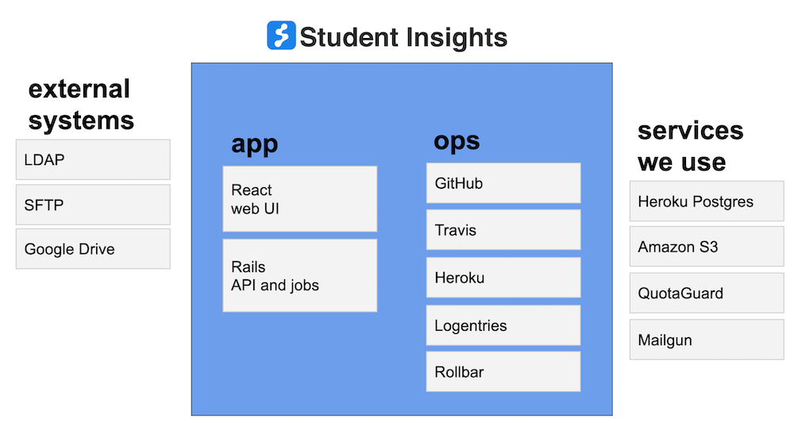
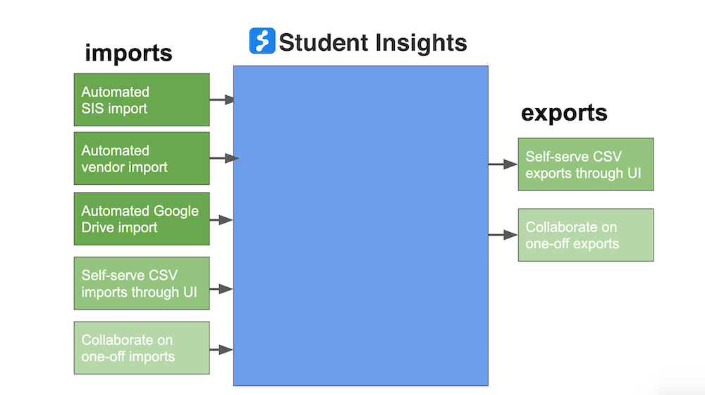

# Student Insights

<div>
  <a style="margin-right: 5px; vertical-align: top; display: inline-block;" href="https://github.com/studentinsights/studentinsights/actions">
    
  </a>
  <a style="margin-right: 5px; vertical-align: top; display: inline-block;" href="https://heroku.com/deploy">
    
  </a>
</div>

## We work with educators to make student-centered data systems
It’s people closest to the work, **within school communities** - teachers, young people, families - who will be able to build the next generation of school data systems that they need.

We need more than just systems for counting numbers - we need ways to more deeply connect and tell our stories to tackle **what matters for our students**.

Learn more at [**studentinsights.org**](https://www.studentinsights.org).

### Demo site
Check out the [**demo site**](https://somerville-teacher-tool-demo.herokuapp.com/) with different roles:

  - District admin: `uri@demo.studentinsights.org` (requires 2FA)
  - K8 principal: `laura@demo.studentinsights.org`
  - Kindergarten teacher: `vivian@demo.studentinsights.org`
  - HS physics teacher: `hugo@demo.studentinsights.org`
  - 9th grade counselor: `sofia@demo.studentinsights.org`

All accounts use the password: `demo-password`.

# Contributing
We'd love your help! Take a look at **[CONTRIBUTING.md](CONTRIBUTING.md)** for more information on ways educators, developers and others can get involved and contribute directly to the project.  You can also learn how to join our online chat channel and submit pull requests and join us in person at our weekly hack night with Code for Boston, in Kendall Square, Cambridge.

## Development Environment

This is a Ruby on Rails app that uses a PostgreSQL database as the primary data store, and relies on React for much of the UI code.

## 1. Install dependencies

You'll need Ruby, Postgres and yarn. See our [local installation on OSX or Linux](docs/technical/local_installation_notes.md) guide.

One you have those set up, you can install the Ruby and JavaScript dependencies with:

```
$ bundle install
$ yarn install
```

## 2. Create database tables and seed them with demo data

```
bundle exec rake db:create db:migrate db:seed
```

This will create demo students with fake student information.  See the demo site above for the set of educators you can use (or look at `test_pals.rb`).

If you are willing to run a longer (~10 minute) task that will generate ~600 students to more closely approximate one of our pilot schools, set `ENV["MORE_DEMO_STUDENTS"] = 'true'` before running the seed task.

## 3. Start the app
Once you've created the data, start the app by running `yarn start` from the root of your project.  This runs two processes in parallel: the Rails server and a Webpack process that watches and rebuilds JavaScript files.  When the local server is up and running, visit http://localhost:3000/ and log in with your demo login information. You should see the roster view for your data.  You can stop both processes with `command+c` like normal, and look at `package.json` if you want to run them in individual terminals.

## 4. Run the tests
This app uses [Rspec](https://www.relishapp.com/rspec/rspec-rails/v/3-2/docs) for Ruby tests and [Jest](https://facebook.github.io/jest/) for JavaScript tests.

For Ruby code, to lint and run the tests do:

```
rspec
```

For Jest, run the tests continually in watch mode with:

```
yarn test
```


There's also [rubocop](https://github.com/bbatsov/rubocop) and [eslint](http://eslint.org/) for linting.  Run them at the command line like this:

```
rubocop
yarn lint
```

Or add them into Sublime with [SublimeLinter-eslint](https://github.com/SublimeLinter/SublimeLinter-eslint) and [SublimeLinter-rubocop](https://github.com/SublimeLinter/SublimeLinter-rubocop).

If you miss something, tests will run on any pull request you submit, and after merging to master as well.

## 5. Write code!
This project is a Rails app and has a typical Rails project structure.  If you'd like to get up to speed on Rails, we recommend checking out their [great documentation](http://guides.rubyonrails.org/).  The only difference is that JavaScript code is not managed by the Rails asset pipeline, and is built separately by Webpack.

It also uses React for much the user interface code.  If you'd like to get up to speed on React, we recommend their great documentation, and the [Tutorial](https://facebook.github.io/react/docs/tutorial.html) and [Thinking in React](https://facebook.github.io/react/docs/thinking-in-react.html) pages in particular.

JavaScript code is written in ES6 syntax and JSX.  The build process uses the the [react-app](https://www.npmjs.com/package/babel-preset-react-app) Babel preset (the same as [create-react-app](https://github.com/facebookincubator/create-react-app)).

If you use **Sublime Text Editor**, we include the `studentinsights.sublime-project` file to standardize minor things like tabs vs. spaces, indentation, and generally make it easier to work with our folder structure. Go to `Project --> Open Project` and select that file to load it. Sublime remembers which project you were last in, so you only need to do this once. ([Here](http://www.joshuawinn.com/understanding-projects-in-sublime-text-saving-switching-etc/)'s some background info on how projects work in Sublime).

We also recommend [Sublime Package Control](https://packagecontrol.io/) and these packages [Babel](https://packagecontrol.io/packages/Babel), [Sublime Linter](http://www.sublimelinter.com/en/latest/) and [SublimeLinter-contrib-eslint](https://github.com/roadhump/SublimeLinter-eslint).  These will give you nice syntax highlighting and show you linter errors right in Sublime!

## 6. Use the product locally
Users use IE11, so if you're trying to manually test locally or the production site, you should too!  If you have a Mac or Linux box, you can use free VMs designed for just this purpose and run them on VirtualBox: https://developer.microsoft.com/en-us/microsoft-edge/tools/vms/.

Useful tidbits:
- Visit get.adobe.com/reader in the VM to install a PDF reader
- These virtual machines expire after 90 days, so take a snapshot right away and rollback when it expires (make sure to log out of Insights before taking a Snapshot, and that no student report PDFs are lying around in the VM's downloads)
- Enable "Shared Clipboard" in the Devices menu
- Disable the "Host Capture" key
- Point to http://10.0.2.2:3000/ to access the host instance of Student Insights

7. Use Storybook
Running `yarn storybook` will start a storybook server on port 6006. You can use this to create "stories" iterate on UI features or components in particular states, separate from how they exist within the product.  To add new stories, write a new `.story.js` file and update `ui/config/.storybook/config.js`.

8. Add guardrails
- Install [git-secrets](https://github.com/awslabs/git-secrets#installing-git-secrets) and ensure the hook is set for the repo
- Update your terminal to show when your git working copy is dirty, to prevent accidentally checking in anything sensitive or that shouldn't be checked in.  One approach is to put this in `~/.bashrc`:

```
# prompt
GIT_PS1_SHOWCOLORHINTS=1
GIT_PS1_SHOWDIRTYSTATE=1
GIT_PS1_SHOWUNTRACKEDFILES=1
GIT_PS1_STATESEPARATOR='  --!--  '
source ~/.git-prompt.sh
PS1='\h:\[\033[1;34m\]\W \[\033[0;33m\][$(__git_ps1 "%s")]\[\033[0;37m\] \$ '
```

You can find a copy of `git-prompt.sh` in source.


# System overview
The project is a Rails app with a Postgres database.  There are background tasks that import data from district SIS systems, vendor systems like STAR, and district data sources within Google Drive.  This enables rapid iteration and experimentation on new product features with minimal risk to these existing production systems.  Student Insights is the system of record for some unique data (eg., notes from clinical meetings and information about targeted interventions that students are receiving).  Authentication is typically handled by the district's LDAP service.

District project leads have access administrative tools for adjusting educator permissions and roles, for doing data quality checks, reviewing health of import tasks, and exporting data.

Understanding the human pieces of how data flows through the system, which is critical for understanding accuracy and representativeness, is quite complex and varies within and across districts.  This is important to keep in mind when making product and engineering decisions.  With that caveat, here's an abstracted engineering-centric view on the pieces of the system and kinds of data flow:




All districts share the same codebase, but are deployed in isolated instances.

### Differences between districts
There are many differences within and across districts.  Some of this is driven by districts focusing on different things or being at different places in adoption, and some is different by inherent differences.  When trying to learn about or understand how Student Insights handles these differences, a good triage process is:

- check `per_district.rb` and `PerDistrict.js` in source code
- look at differences in environment variables
- check for differences in actual data (eg, fields used or specific enum values)
- also look at `EducatorLabel` which describes different feature switches, which are often related to important differences across or within districts

For educator-facing document, see also:

- [Student Insights: Project Lead FAQ](https://docs.google.com/document/d/1Q5CFXd9kYYnQXl2g73A0woS00YgDG19L9nITO3JCS2s/edit#)
- [Student Insights: Educator FAQ](https://docs.google.com/document/d/1OSSFQ13KjgCOHNbWjbAMCdDW3S_U8LEcByfBAXSYbTo/edit#)


# Deployment

### Continuous integration
We use GitHub Actions to run a set of tests on each pull request and merge to master.  See the `actions.yml` file for more, and view test runs it GitHub at https://github.com/studentinsights/studentinsights/actions.

### Deploying new code to Insights

See our guide:

[Merging and deploying new code to Heroku](docs/technical/merging_and_deploying_to_heroku.md).

### Creating a new Insights instance
[Creating a new Insights instance](docs/technical/new_instance.md).


### Heroku notes

[Quotaguard Static](https://www.quotaguard.com/static-ip), a Heroku add-on, provides the static IP addresses needed to connect with district LDAP servers which are firewalled.  The `QUOTAGUARDSTATIC_MASK` environment variable is a subnet mask for routing only certain outbound requests through the static IPs. [Read Quotaguard Static's documentation for more information.](https://devcenter.heroku.com/articles/quotaguardstatic#socks-proxy-setup)


# Ops
Here are some notes on maintaining, troubleshooting and performance.

## Response latency
Look in the Heroku metrics panel.

## Postgres
You can use [heroku-pg-extras](https://github.com/heroku/heroku-pg-extras) to get helpful diagnostic information about slow queries, index usage, and table scans.

Heroku Postgres supports a maintenance window for standard database operations that require minutes of downtime.  See `heroku pg:maintenance`.

# More information

- [Drop into the #somerville-schools chat](https://cfb-public.slack.com/messages/somerville-schools/) on [Code for Boston Slack](http://public.codeforboston.org/)
- Connect with [Kevin](https://twitter.com/krob) on Twitter or on Code for Boston Slack
- More docs in the `docs` folder!
- Learn more at [studentinsights.org](https://www.studentinsights.org).